# Hospital Network Infrastructure Design - Saudi German Hospital

I built this entirely on my own. No group, no partner, just me, Cisco Packet 
Tracer, and a lot of time figuring things out. The brief was to design a 
network for a real hospital — Saudi German Hospital — from scratch. Not a 
simple flat network either. Three physically separate branches, dozens of 
departments, security controls, attack simulations, VoIP, email servers, 
VPN tunnels, and a full IP addressing scheme. The kind of infrastructure 
that an actual hospital would need to run.

This project is what made networking click for me. You can read about VLANs 
and OSPF all you want but when you are sitting there at 2am trying to figure 
out why inter-VLAN routing is not working between the Pharmacy and the 
Emergency Room, it becomes real very quickly.

---

## The Hospital

Saudi German Hospital is split into three branches, each with its own 
departments and its own network requirements. Every branch needed to be 
isolated enough for security but connected enough for the hospital to 
function as one organisation.

**Patient Care Branch** — the clinical heart of the hospital. Six departments:
- Reception
- Guest Waiting Area
- Critical Care
- Emergency Room
- Maternity Ward
- Pharmacy

**Operational Hub Branch** — the business engine running behind the scenes:
- Administration
- IT
- HR
- Finances
- Call Centre

**Call Centre Branch** — a dedicated communications branch cloned directly 
from the Operational Hub's Call Centre department to increase speed and 
redundancy in emergency communications. Directly connected to its counterpart 
in the Operational Hub for instant inter-branch communication.

---

## What Was Built

### Network Topology

The full topology connects three branch routers through a central Layer 3 
switch, with each branch having its own multi-layer switch handling 
inter-VLAN routing internally. A dedicated server room sits within the 
Operational Hub housing the DHCP and Email servers that serve the entire 
network.

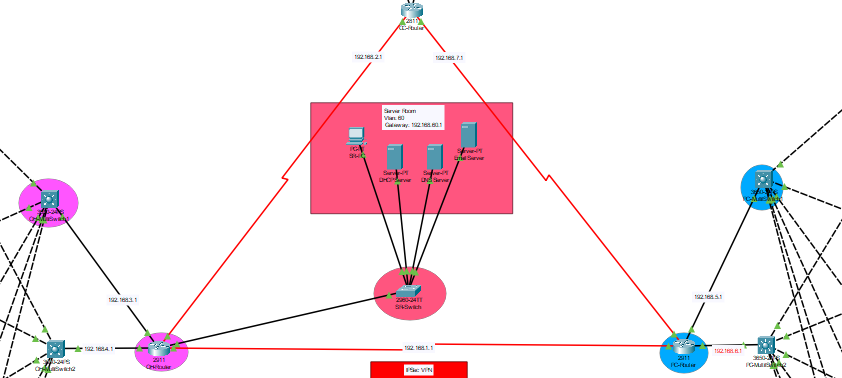

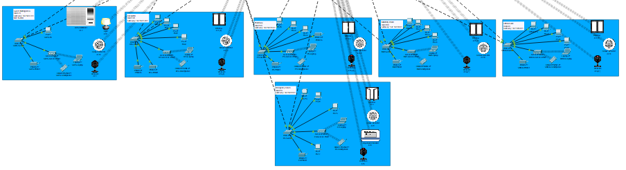

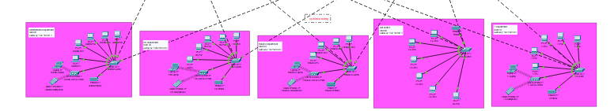

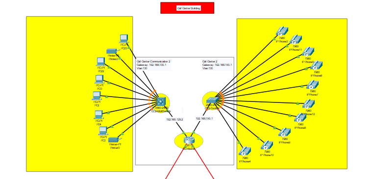

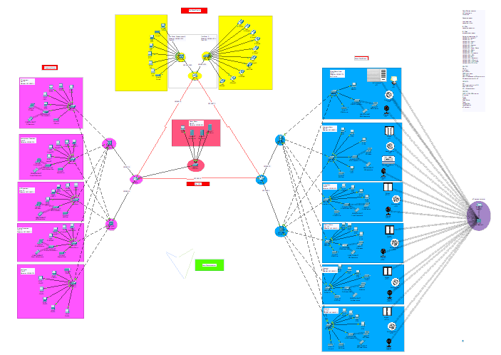

---

### IP Addressing Scheme

Every device in the network was manually assigned or configured for dynamic 
assignment via DHCP. Critical infrastructure like routers and servers received 
static IPs. Everything else was pooled through the DHCP server.

The addressing used a structured scheme across the 192.168.x.0/24 range, with 
each department mapped to its own VLAN and subnet. Super subnetting was applied 
in the ACL configuration to summarise multiple department IP ranges into single 
summary addresses, keeping the access control rules clean and manageable.

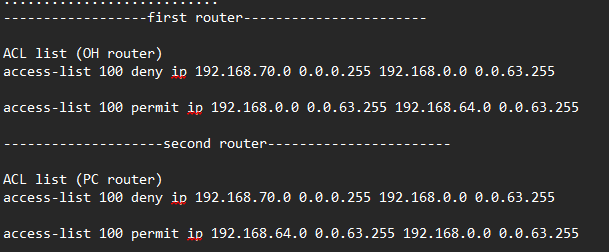

---

### Mechanisms Implemented

**VLANs and SVIs**
Every department got its own VLAN, completely isolating their traffic at 
Layer 2. Switched Virtual Interfaces on the multi-layer switches then allowed 
controlled inter-VLAN routing — departments that needed to talk to each other 
could, and those that should not were blocked at the ACL level.

**OSPF Dynamic Routing**
Open Shortest Path First was configured across all routers and multi-layer 
switches in a single Area 0. OSPF automatically calculates the most efficient 
path for traffic between branches, adapts to topology changes, and eliminates 
the manual overhead of static routing across a network this size.
router ospf 10
network 192.168.1.0 0.0.0.255 area 0
network 192.168.2.0 0.0.0.255 area 0
network 192.168.60.0 0.0.0.255 area 0

**IPsec VPN**
An encrypted tunnel was established between the Patient Care and Operational 
Hub branches using IPsec with AES-256 encryption, SHA-HMAC authentication, 
and Diffie-Hellman Group 5. The Security License was installed on the routers 
before this configuration could be applied. This ensures that inter-branch 
traffic cannot be intercepted even if someone gained access to the connecting 
links.
crypto isakmp policy 10
encryption aes 256
authentication pre-share
group 5

**ACL Traffic Control**
Access Control Lists were configured at the two branch-connecting routers 
to enforce the hospital's security policy. The Guest Waiting Area was 
explicitly denied access to any other department across the entire network. 
All other departments were permitted access according to their operational 
requirements. Super subnetting was used to summarise IP ranges in the ACL 
rules.

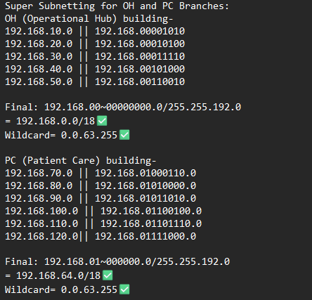

**DHCP Server**
A centralised DHCP server in the server room manages IP assignment for all 
12 departments across the hospital. Each VLAN has its own pool, and the 
`ip helper-address` command on each SVI forwards DHCP requests from 
end devices to the server.

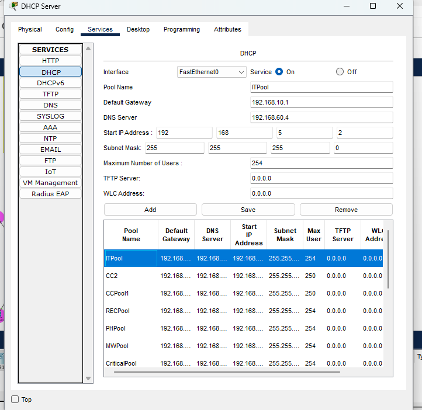

**Email Server**
Every department has a dedicated email account following the format 
`DepartmentName@tkh.edu.eg`. The email server was configured and verified 
to handle internal hospital communications across all 12 departments.

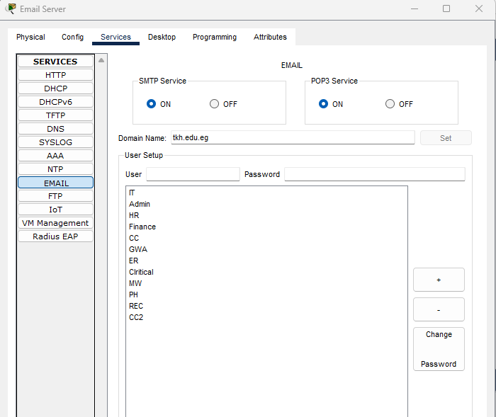

**VoIP**
IP phones were deployed using Cisco's telephony service. A dedicated VOICE 
DHCP pool was created on the router, and each phone was assigned a four-digit 
extension number in the 21001-21010 range. The switches were configured to 
carry voice VLAN traffic separately from data traffic.

**SSH Remote Access**
All routers and multi-layer switches were configured with SSH for secure 
remote management. RSA keys were generated at 1024 bits, a local username 
and password was set, and VTY lines were restricted to SSH only — Telnet 
disabled entirely.

**Switch Port Security**
Every switch port in the server room was locked down to a maximum of one 
MAC address using sticky learning. Any unauthorised device plugging into a 
port immediately triggers a security violation and shuts the port down.

---

### Attack Scenarios

Two attack scenarios were simulated to prove the security controls actually 
work and not just exist on paper.

**Denial of Service via ACL - Guest Waiting Area**

An attacker posing as a hospital visitor in the Guest Waiting Area attempts 
to send malicious traffic deeper into the network. The ACL on the branch 
router silently drops every packet leaving that subnet.

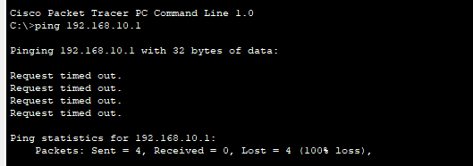

After multiple test runs, 156 packet matches were recorded — all denied. 
The guest network is completely isolated from every other department with 
zero exceptions.

**Switch Port Security - Unauthorised Device in Server Room**

An attacker physically breaches the server room and unplugs a legitimate 
device from a switch port, then connects their own laptop. The switch 
immediately detects the MAC address mismatch and activates Secure-Shutdown 
on that port. The attacker's device gets nothing. The violation counter 
increments to 1 and the port stays down until manually cleared by an admin.

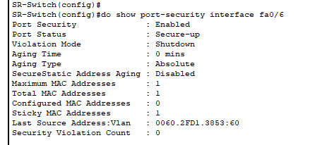

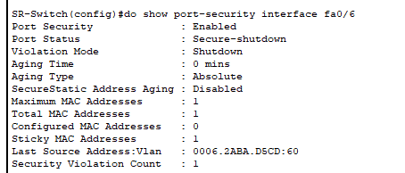

---

## Key Configurations

All routers and multi-layer switches share a common base configuration:
hostname (DeviceName-Branch)
enable password adam
banner motd #No Unauthorized Access#
no ip domain lookup
ip domain name cisco.net
username admin password cisco
crypto key generate rsa
1024
line vty 0 15
login local
transport input ssh

VLAN creation and port assignment:
vlan (VLAN ID)
name (Department Name)
int range fa0/1
switchport mode trunk
int range fa0/2-24
switchport mode access
switchport access vlan (VLAN ID)

Switch Port Security:
int range fa0/3-24
switchport port-security maximum 1
switchport port-security mac-address sticky
switchport port-security violation shutdown

---

## Technologies and Protocols

| Technology | Purpose |
|---|---|
| VLAN | Department traffic segmentation |
| SVI | Inter-VLAN routing on multi-layer switches |
| OSPF | Dynamic routing between branches |
| IPsec VPN | Encrypted inter-branch tunnel (AES-256) |
| ACL | Traffic filtering and access control |
| DHCP | Automatic IP assignment for all departments |
| SSH | Secure remote management of all devices |
| Switch Port Security | Physical port lockdown with MAC filtering |
| VoIP | IP phone deployment with telephony service |
| Email Server | Internal departmental communications |
| DNS | Domain name resolution |

---

## Devices Used

PCs, Layer 2 Switches, Layer 3 Switches, Routers, Servers, Printers, 
IoT Devices, IP Phones, Access Points, Laptops, Smartphones, 
Home Gateways, and Tablets — across three branches and twelve departments.

---

## What I Learned

The part that took the longest to get right was the ACL super subnetting. 
Getting the wildcard masks to correctly summarise multiple /24 networks into 
one ACL rule without accidentally blocking traffic that should be permitted 
took several attempts. Once it clicked it felt like a genuine breakthrough.

The Switch Port Security attack scenario was the most satisfying moment of 
the project. Watching a port immediately shut down the second an unauthorised 
MAC address appeared — something I had configured myself from scratch — made 
the whole thing feel real rather than academic.

Building something this size completely solo also taught me how important 
documentation is when you are managing dozens of devices. The IP scheme 
tables and configuration notes I kept throughout the project were the only 
thing standing between me and complete chaos.

---

*Module: KH5037CMD Foundation of Networking | Coventry University*
*Tool: Cisco Packet Tracer*
